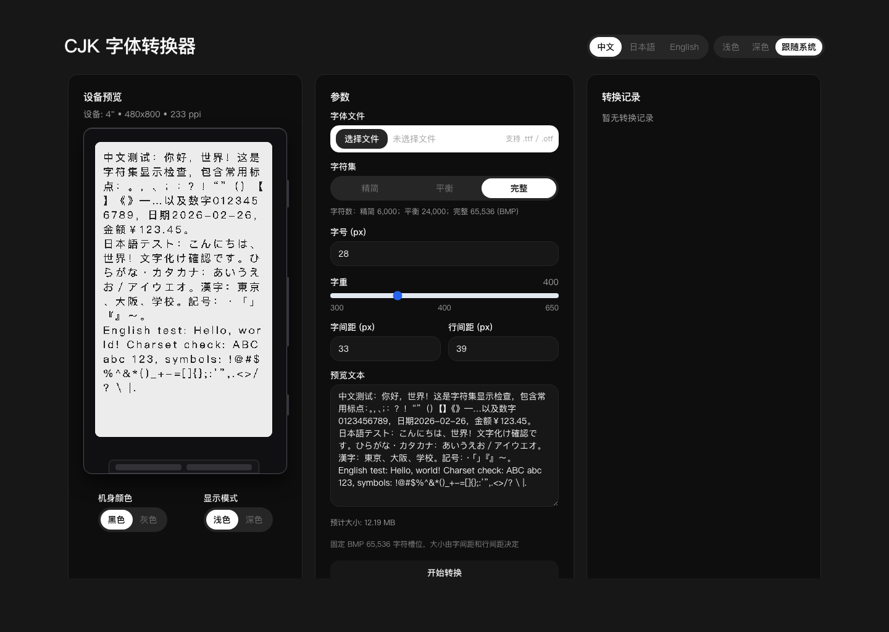

# xteink-cjk-font-maker

Web font converter for generating `crosspoint-reader-cjk` compatible `.bin` files.

[English](README.md) | [简体中文](README.zh.md) | [日本語](README.ja.md)



## Features

- Upload `TTF/OTF` font files
- Choose charset tier: `6k`, `24k`, `65k`
- Configure rendering params: `font_size_px`, `font_weight`, `output_width_px`, `output_height_px`
- Async conversion workflow
- PWA-capable web UI

## Project Layout

- Node server entry: `server/index.ts`
- API logic: `worker/src/api.ts`
- Background conversion helper: `worker/src/consumer.ts`
- Web source: `web/`
- Web build output: `web/dist`
- Docker production image: `Dockerfile`
- Docker development stack: `docker-compose.dev.yml`
- Docker production stack: `docker-compose.yml`

## Prerequisites

- Node.js 20+
- npm
- Docker / Docker Compose (optional)

## Local Development

Install dependencies and run the test/build baseline first:

```bash
npm install
npm test
npm run build
```

Run the full stack locally:

```bash
npm run dev
```

This starts:

- Node API: `http://127.0.0.1:3000`
- Vite web app: `http://127.0.0.1:5173` (with `/api/*` proxy)

### Optional local variable

- `VITE_API_PROXY_TARGET`
  - Used by `web/vite.config.mjs`
  - Default: `http://127.0.0.1:3000`

## Docker Development

```bash
docker compose -f docker-compose.dev.yml up --build
```

This starts:

- Node API: `http://127.0.0.1:3000`
- Vite web app: `http://127.0.0.1:5273`

## Docker Production

```bash
docker compose up --build
```

This starts the production Node server on `http://127.0.0.1:3000` and serves the built frontend from `web/dist`.

## PWA Support

The web app supports installable PWA in production build:

- Manifest: `web/public/manifest.webmanifest`
- Service Worker: `web/public/sw.js`
- Icons: `web/public/icon-192.png`, `web/public/icon-512.png`

Verify locally:

```bash
npm run web:build
npm run web:preview
```

## Additional Docs

- Operational limits: `docs/ops/limits.md`
