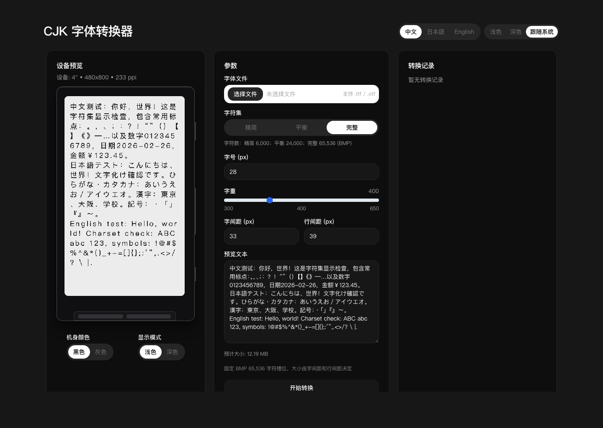

# xteink-cjk-font-maker

用于浏览 CrossPoint 公开 CJK 字体，并把私人 `TTF/OTF` 转换成当前正式 `.cpfont v4` SD 卡字体包的 Web 应用。

[English](README.md) | [简体中文](README.zh.md) | [日本語](README.ja.md)



## 当前正式格式

默认转换流程调用 [`aBER0724/crosspoint-cjk-fonts`](https://github.com/aBER0724/crosspoint-cjk-fonts) 的规范 Python/FreeType 转换器，生成包含以下物理字号的确定性 ZIP：

```text
8 / 10 / 12 / 14 / 16 / 18 / 22 pt
```

包内同时包含 `SHA256SUMS` 和 `build.json` 构建溯源。设备只选择真实物理文件，不会在运行时缩放 CJK 字体。

原有 `legacy-bin` 和实验性 `xbf2` 保留在 **旧格式工具** 中；它们不是当前 SD 卡字体目录格式。

## 字体库

React 字体库直接读取：

```text
https://aber0724.github.io/crosspoint-cjk-fonts/catalog.json
```

页面展示由真实 `.cpfont` 点阵生成的预览，并直接链接版本化 GitHub Release，不代理或重新托管字体大文件。字体库加载失败不会影响私人字体转换。

## 功能

- 浏览、搜索、预览和下载已发布字体
- 上传不超过 20 MiB 的私人 `TTF/OTF`
- 生成七个物理字号的 `.cpfont v4`，可选 FreeType 自动 Hinting
- 下载含哈希与构建溯源的 ZIP
- 保留 `legacy-bin` 与实验性 `xbf2`
- 异步任务、转换历史、多语言 UI 和 PWA

## 项目结构

- Node 服务：`server/index.ts`
- API 与任务消费：`worker/src/api.ts`、`worker/src/consumer.ts`
- 规范转换器适配：`worker/src/cpfont/`
- React 前端：`web/`
- 生产镜像：`Dockerfile`
- 运行限制：`docs/ops/limits.md`

## 本地开发

需要：

- Node.js 22
- npm
- Python 3.11
- 同级目录 `../crosspoint-cjk-fonts`，或设置 `CPFONT_TOOL_ROOT`

首次准备规范工具链：

```bash
cd ../crosspoint-cjk-fonts
python -m pip install -r requirements.txt
python scripts/fetch_fallback.py
cd ../crosspoint-cjk-font-maker
```

安装与验证：

```bash
npm ci
npm test
npm run build
npm run dev
```

地址：

- Node API：`http://127.0.0.1:3000`
- Vite：`http://127.0.0.1:5173`
- 能力检查：`http://127.0.0.1:3000/api/capabilities`

可选变量：

- `CPFONT_TOOL_ROOT`：规范字体仓库目录
- `CPFONT_PYTHON`：安装了锁定依赖的 Python
- `VITE_API_PROXY_TARGET`：本地 API 代理地址
- `VITE_FONT_CATALOG_URL`：字体目录 JSON
- `VITE_FONT_CATALOG_PAGE_URL`：独立字体目录页面

上传后的设备预览使用浏览器源字体近似渲染，并非最终点阵。字体库中的示例则来自实际 `.cpfont v4` 2-bit 点阵。

## Docker

```bash
docker compose up --build
```

生产镜像使用 Debian、Python venv、SHA-256 锁定 fallback 和固定的 `crosspoint-cjk-fonts` commit。升级转换工具链必须显式修改并审查固定版本。

开发编排：

```bash
docker compose -f docker-compose.dev.yml up --build
```

## 验证

```bash
npm test
npm run build
docker build -t crosspoint-cjk-font-maker .
```

CI 还会启动生产镜像，并要求 `/api/capabilities` 报告 `.cpfont` 版本 4 和七个物理字号。
